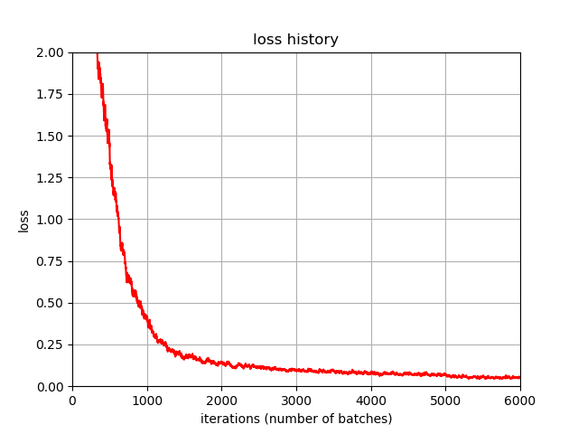

This is part of my [Winter Project at NWU](https://github.com/felixchenfy/Detect-Object-and-6D-Pose)

Data Augmentation and Train Yolo3
=======================================

|Bottle |Meter |
|:---:|:---:|
||  |

Video links: [bottle](https://github.com/felixchenfy/Data-Storage/raw/master/Data-Augment-and-Train-Yolo/bottle_result.avi), [meter](https://github.com/felixchenfy/Data-Storage/raw/master/Data-Augment-and-Train-Yolo/bottle_result.avi).

**Contents**:

- [Data Augmentation and Train Yolo3](#data-augmentation-and-train-yolo3)
- [1. Workflow](#1-workflow)
  - [(1) Collect training data](#1-collect-training-data)
  - [(2) Data augmentation](#2-data-augmentation)
  - [(3) Train Yolo](#3-train-yolo)
- [2. Installation](#2-installation)
  - [2.1 Install Yolo3 (Darknet)](#21-install-yolo3-darknet)
  - [2.2 Download model](#22-download-model)
      - [(1) Download Pretrained Convolutional Weights](#1-download-pretrained-convolutional-weights)
      - [(2) Download my training result](#2-download-my-training-result)
  - [2.3 Download my data](#23-download-my-data)
  - [2.4 Install python libraries](#24-install-python-libraries)
- [3. Data augmentation](#3-data-augmentation)
  - [3.1 How to run](#31-how-to-run)
  - [3.2 Details](#32-details)
- [4. Train Yolo](#4-train-yolo)
  - [4.1 Setup](#41-setup)
  - [4.2 Train](#42-train)
  - [4.3 Test](#43-test)
- [TODO](#todo)

# 1. Workflow

## (1) Collect training data

Shoot RGB-D images of the object by depth camera. Automatically get the mask of the object. See this [Github repo](https://github.com/felixchenfy/Mask-Objects-from-RGBD).


## (2) Data augmentation

Put masked objects onto different background images with random locations, scales, rotations, and shear. I put 2 objects on each image.


## (3) Train Yolo
See below.

# 2. Installation


## 2.1 Install Yolo3 (Darknet)

I'm using [this version](https://github.com/AlexeyAB/darknet). A short installation note is given below:

* cd into the root of my project and download:
    > $ git clone https://github.com/AlexeyAB/darknet   
* Change Makefile  
    > $ subl darkent/Makefile

    Set some numbers from 0 to 1 as follows:  
    GPU=1  
    CUDNN=1  
    CUDNN_HALF=1  
    OPENCV=1  
* Make
  > $ cd darknet && make && cd ..   

* Then copy some necessary files to my data folder, which is required later:  
    > $ cp -r darknet/data/labels data/


## 2.2 Download model

#### (1) Download Pretrained Convolutional Weights
See [this page](https://pjreddie.com/darknet/yolo/). Its pretrained on Imagenet. I used it for training my detector.

> $ cd model  
> $ wget https://pjreddie.com/media/files/darknet53.conv.74

Test if Darkent is installed correctly:  
> $ cd darknet && ./darknet detector test ./cfg/coco.data ./cfg/yolov3.cfg ./yolov3.weights data/dog.jpg


#### (2) Download my training result
Download from [here](https://drive.google.com/file/d/186w5NqAYMRcDr8xPXEANqd2jay0x3Tp7/view?usp=sharing
). Extract and put into the **model/** folder.


## 2.3 Download my data

Download from [here](https://drive.google.com/file/d/1v3SXmiZOT-rVOGjn2TP84_1j-YIaQ44a/view?usp=sharing). Extract and put into **data/** folder.

## 2.4 Install python libraries
Go into a virtual environment with Python3, and then:

```
pip install skimage  
etc.
```


# 3. Data augmentation


## 3.1 How to run

Open and run [src1_data_aug/create_new_images.ipynb](src1_data_aug/create_new_images.ipynb) to generate training **images** and **labels**.

The input are:
```
data
├── b_room_1
├── b_room_2
├── b_room_3
├── b_voc_2009
├── d_bottle_1
├── d_meter_1
├── d_meter_2
```

The output are:
```
data_yolo
├── images
├── labels (optional)
├── images_info.txt
├── classes.txt
```


* **label files in data_yolo/images/**  
  Each image has one corresponding **.txt** label file which specifies the objects in the image. One row, one object.  
  Format: ```<object-class> <x> <y> <width> <height>```  
  Example:
  ```
  0 0.190625 0.5520833333333334 0.059375 0.11666666666666667
  0 0.421875 0.5208333333333334 0.0875 0.15416666666666667
  ```

* **data/images_info.txt**  
  The file [data/images_info.txt](data/images_info.txt) stores the path of training images. Use python to read it and do a train-test split:  

  > $ cd data_yolo  
  > $ python train_test_split.py  

  The output are [data/test.txt](data/test.txt) and [data/train.txt](data/train.txt).


## 3.2 Details

I put 98 objects (50 bottle + 48 meter) onto different backgrounds to generate 1095 images.

Objects are from: [data/d_bottle_1](data/d_bottle_1), [data/d_meter_1](data/d_meter_1), [data/d_meter_2](data/d_meter_2).  
Background images are from [data/b_room_1](data/b_room_1).

To balance the positive and negative images, some images containing no object are also used for training. They are from: [data/b_room_2](data/b_room_2), [data/b_room_3](data/b_room_3), [data/b_voc_2009](data/b_voc_2009). Total image number = 616 = 170 + 188 + 258. 

The total image number is 1711. Images and labels are stored in [data_yolo/images](data_yolo/images).


# 4. Train Yolo

## 4.1 Setup

I put following configuration files into [src2_train_yolo/](src2_train_yolo/) for training yolo.
```
src2_train_yolo
├── my-train.data
├── yolov3-my-test.cfg
└── yolov3-my-train.cfg
```

[src2_train_yolo/my-train.data](src2_train_yolo/my-train.data) stores the paths to train.txt, valid.txt, and classes.txt.

[src2_train_yolo/yolov3-my-train.cfg](src2_train_yolo/yolov3-my-train.cfg) stores the training parameters. It's set based on [this tutorial](https://github.com/AlexeyAB/darknet#how-to-train-to-detect-your-custom-objects).


## 4.2 Train

* **Train:**  
  > $ ./darknet/darknet detector train src2_train_yolo/my-train.data src2_train_yolo/yolov3-my-train.cfg model/darknet53.conv.74 | tee results/mylog.txt

* **Parameters:**  

    Train/test split = 8 / 2.  
    Trained for 6000 iterations.

* **Loss history:**  
    
    

    During training, I saved the log to "results/mylog.txt". Then, I use this script [results/plot_loss_from_txt.py](results/plot_loss_from_txt.py) to plot the above figure.

* **Results on test set:**  

    > $ ./darknet/darknet detector map src2_train_yolo/my-train.data src2_train_yolo/yolov3-my-train.cfg model/v1-6000.weights

    The output results are:

    ```
    detections_count = 469, unique_truth_count = 442  
    class_id = 0, name = bottle, 	 ap = 90.91 % 
    class_id = 1, name = meter, 	 ap = 90.91 % 
    for thresh = 0.25, precision = 1.00, recall = 0.95, F1-score = 0.97 
    for thresh = 0.25, TP = 418, FP = 0, FN = 24, average IoU = 88.67 % 

    IoU threshold = 50 % 
    mean average precision (mAP@0.50) = 0.909091, or 90.91 % 
    Total Detection Time: 9.000000 Seconds
    ```

* **Speed**
  
* Test single image:    
image size: 416x416  
time = 22.6 ms  
  
* Test a batch of images:  
image size: 416x416  
time = 9s/469 = 19.2 ms  


## 4.3 Test


* **Test on single image:**  
  > $ ./darknet/darknet detector test src2_train_yolo/my-train.data src2_train_yolo/yolov3-my-test.cfg model/v1-6000.weights data_yolo/example1.png -thresh 0.25  
  > $ ./darknet/darknet detector test src2_train_yolo/my-train.data src2_train_yolo/yolov3-my-test.cfg model/v1-6000.weights data_yolo/example2.png -thresh 0.25

* **Test on video (Not working):**   
  > $ ./darknet/darknet detector demo src2_train_yolo/my-train.data src2_train_yolo/yolov3-my-test.cfg model/v1-6000.weights data_yolo/test_bottle.avi -out_filename video_result.avi  

  Bad result: (1) Low framerate. (2) The output avi cannot be opened.  

* **Batch detecting images (Not working):**
  > $ ./darknet/darknet detector test src2_train_yolo/my-train.data src2_train_yolo/yolov3-my-test.cfg model/v1-6000.weights -dont_show < data_yolo/video_bottle.txt > result.txt  

  Bad result: (1) The bounding box information is not saved to txt, but only the detection result. (2) If not using -dont_show, I'll have to press keys one by one, which is pretty slow.  

* **Batch detecting images (Error)**:  
  The repo is from https://github.com/vincentgong7/VG_AlexeyAB_darknet  
  > $ ./darknet/darknet detector batch src2_train_yolo/my-train.data src2_train_yolo/yolov3-my-test.cfg model/v1-6000.weights batch data_yolo/video_bottle/images/ tmp/ > tmp/results.txt  

* **Batch detecting images (Slow)**:  
    See this script [src2_train_yolo/bash_detect_images_in_txt.py](src2_train_yolo/bash_detect_images_in_txt.py).   
    It runs the "./darknet/darknet detector test" command for all images in a folder and save the resultant images to another folder. 

# TODO

1. In data augmentation: Add more small objects. Add motion blur.  
2. Improve README.
3. Change source code to enable input of video or batch images.
4. Integrate with my Winter Project to detect object 6D pose.